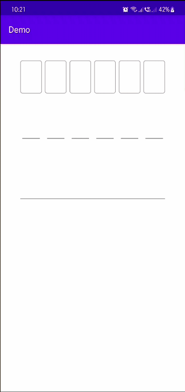
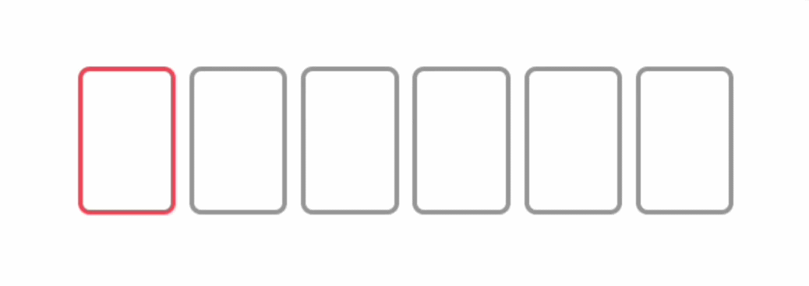

PinEntryView
============

## About

A PIN entry view widget for Android.  This is a fork of
[Philio/PinEntryView](https://github.com/Philio/PinEntryView), refactored to Kotlin, updated to use
the latest Android libraries and added some new features.



Uses a hidden `EditText` to handle input, hence behaves much in the same was as an `EditText` on the
screen and supports similar features.

## Change log

* 1.1.1
  - Minor clean up

* 1.1.0
  - When using a custom `digitBackground`, you can now specify a color selector to highlight the
    current entry.  Use `android:state_activated="true"` for this.  Example:
    ```xml
    <!-- layout XML -->

    <io.github.rexmtorres.android.pinentry.PinEntryView
        ...
        app:digitBackground="@drawable/digit_bg_boxed"
        app:numDigits="6" />
    ```
    ```xml
    <!-- drawable/digit_bg_boxed.xml -->

    <shape
        xmlns:android="http://schemas.android.com/apk/res/android"
        android:shape="rectangle">
        <solid
            android:color="@android:color/transparent"/>
        <corners
            android:bottomRightRadius="4dp"
            android:bottomLeftRadius="4dp"
            android:topLeftRadius="4dp"
            android:topRightRadius="4dp"/>
        <stroke
            android:color="@color/filled_stroke_color"
            android:width="2dp"/>
    </shape>
    ```
    ```xml
    <!-- color/filled_stroke_color.xml -->
    
    <selector xmlns:android="http://schemas.android.com/apk/res/android">
        <item android:color="#FF5555" android:state_activated="true"/>
        <item android:alpha="0.42" android:color="#000000"/>
    </selector>
    ```
    
    
  - Fixed crash when pasting text from the clipboard through the context menu.

* 1.0.0
  - Kotlin implementation based on 1.0.6 [Philio/PinEntryView](https://github.com/Philio/PinEntryView)
  - Implemented support for long-press menu for pasting text and clearing input.

## Download

### Gradle

Add the following to your `build.gradle`:
```groovy
implementation "io.github.rexmtorres.android:pinentryview:1.1.1"
implementation "io.github.rexmtorres.android:pinentryview:1.1.1"
```

## Styling

### Attributes

* `numDigits` - The number of digits in the PIN, default 4.
* `digitWidth` - The width of the digit view, default 50dp.
* `digitHeight` - The heigh of the digit view, default 50dp.
* `digitSpacing` - The distance between the digit views, default 20dp.
* `digitBackground` - A resource to use for the digit views, supports drawables or colours and can
  be used with a custom selector as an alternative to using the built in accent support (by setting
  the `accentColor` as transparent). Defaults to `android:windowBackground` from the current theme.
* `digitTextSize` - The size of the text in the digit view, default 15sp.
* `digitTextColor` - The colour of the text in the digit view, defaults to `android:textColorPrimary`
  from the current theme.
* `digitElevation` - Set the elevation of the digit views, API 21+ only, default 0dp.
* `mask` - A character to use as a mask for the entered PIN value, can be set to an empty string to
  show typed numbers, default *.
* `pinAccentColor` - The colour of the accent to use to highlight the view when it's in focus, defaults
  to `android:colorAccent` from the current theme.
* `accentWidth` - The width of the accent highlight, default 3dp.
* `accentType` - Defines the behaviour of the accent, default none, options:
  * `none` - disabled
  * `all` - highlights each separate digit view
  * `character` - highlights a single digit view to represent the position of the cursor
* `accentRequiresFocus` - show accent only when focused, default true
* `pinInputType` - Set the input type, default number, options:
  * `text` - full keyboard, any available character allowed
  * `number` - numeric keyboard, only numbers allowed

## License

Copyright 2021 Rex M. Torres

Licensed under the Apache License, Version 2.0 (the "License");
you may not use this file except in compliance with the License.
You may obtain a copy of the License at

&nbsp;&nbsp;&nbsp;&nbsp;http://www.apache.org/licenses/LICENSE-2.0

Unless required by applicable law or agreed to in writing, software
distributed under the License is distributed on an "AS IS" BASIS,
WITHOUT WARRANTIES OR CONDITIONS OF ANY KIND, either express or implied.
See the License for the specific language governing permissions and
limitations under the License.